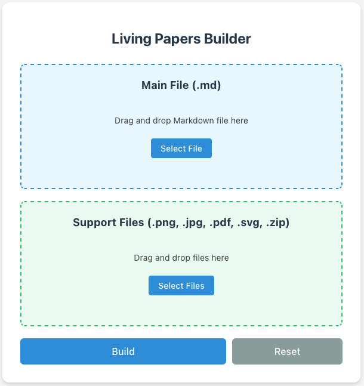
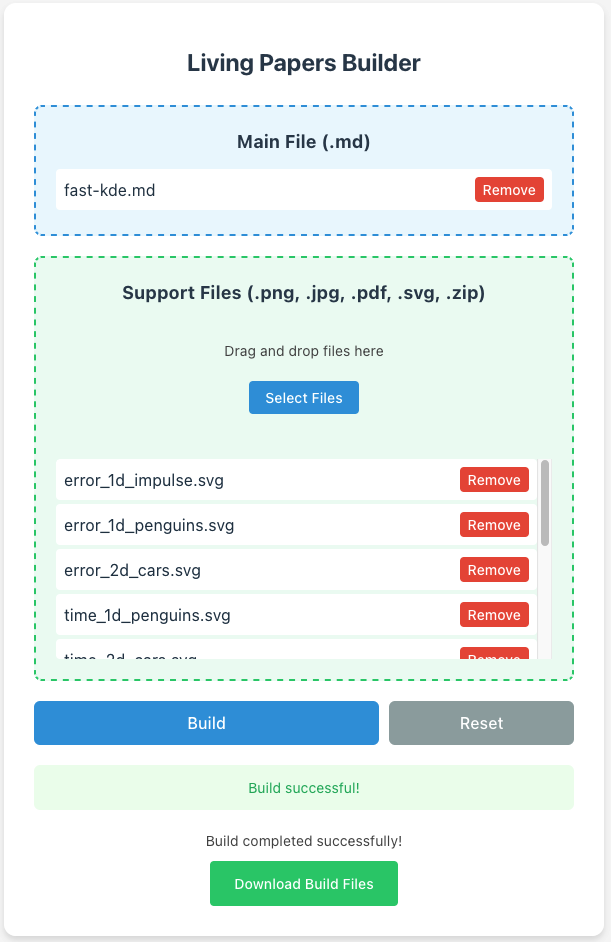

# Living Papers Builder

A web-based interface for compiling [Living Papers](https://github.com/uwdata/living-papers) documents. This tool provides a graphical interface for Living Papers compilation instead of command-line operations.

## Installation Guide

Install nvm using Homebrew:

```bash
brew install nvm
```

Install Node.js v18.1.0:

```bash
nvm install v18.1.0
nvm use v18.1.0
```

Install Pandoc v2.18 from the [official release](https://github.com/jgm/pandoc/releases/tag/2.18).

Install R from [CRAN](https://cloud.r-project.org/) and required packages:

```R
install.packages(c("knitr", "tidyverse", "jsonlite", "svglite"))
```

Install LaTeX environment from [MacTeX](https://www.tug.org/mactex/mactex-download.html).

Clone and set up the Living Papers project:

```bash
git clone https://github.com/uwdata/living-papers.git
cd living-papers
npm install
npm run build
npm run test

cd packages/web-server
npm install
cd client && npm install
cd ../server && npm install
```

## Usage

Start the development server from the web-server directory:

```bash
cd living-papers/packages/web-server
npm run dev
```

Access the web interface at http://localhost:5173/ and the server at [http://localhost:3000](http://localhost:3000/).

The web interface allows you to:

- Upload Markdown papers through drag-and-drop or file selection
- Include supplementary files like images and PDFs
- Upload multiple files via zip archives
- Preview and download compiled papers
- Compile papers without using command line

## Project Structure

The web builder is organized within the Living Papers project:

```
living-papers/
└── packages/
    └── web-server/
        ├── client/     # React frontend
        ├── server/     # Node.js backend
        └── package.json
```

## Screenshots

User Interface:

                       

Uploading and Downloading:


